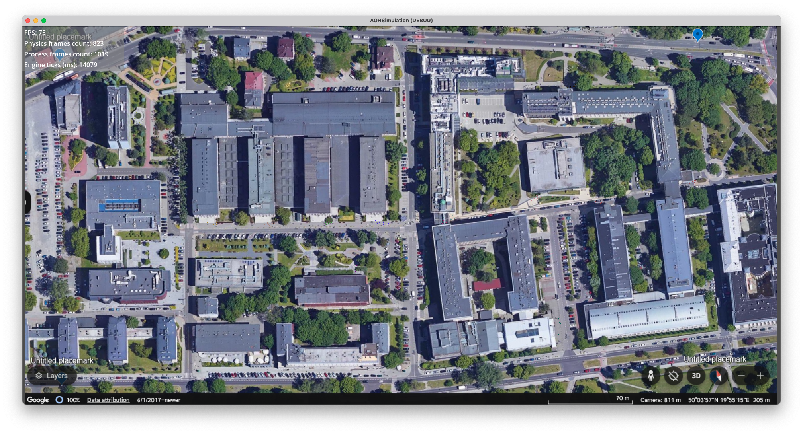
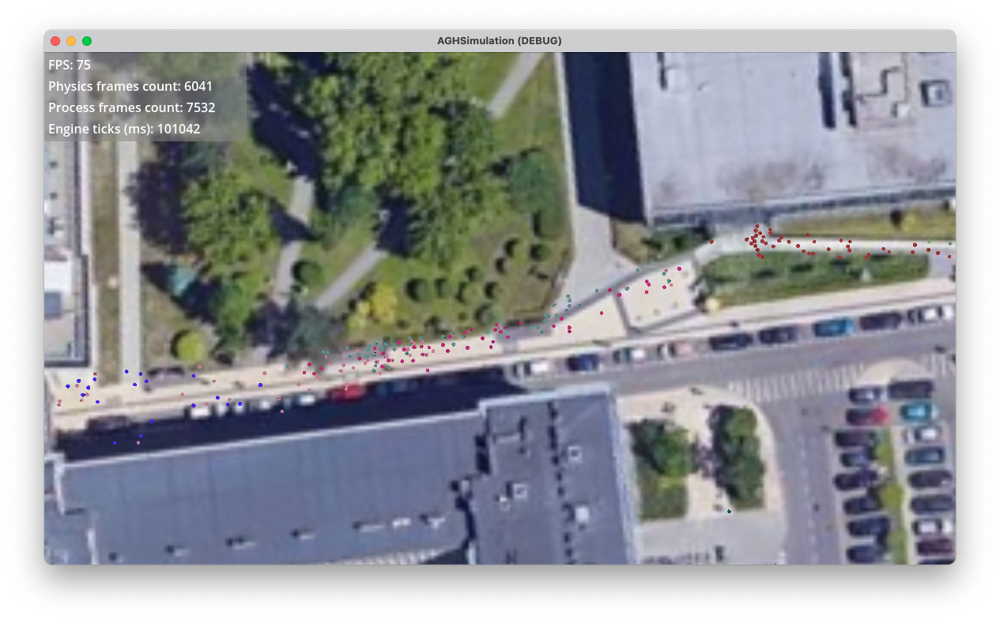

# Scope of the project

The report delineates the issue of crowd flow on the AGH campus, employing the Social Force model to illustrate the phenomenon. The model under scrutiny offers a precise representation of pedestrian behaviour in that it accurately reflects the tendency of individuals to circumvent collisions with others (as illustrated in [@fig:laufer2008passenger-000]). In contrast to the tendency to reach one's destination expeditiously, pedestrians appear to prioritise the avoidance of collisions. Furthermore, the Social Force model incorporates the tendency of agents to maintain a safe distance from obstacles, such as lawns or walls, which aligns with empirical observations.

![Attributes of the Social Force Model [@laufer2008passenger]](images/laufer2008passenger-000.png){#fig:laufer2008passenger-000 width=75%}

The focal point of the study pertained to the area demarcated by buildings A-0 and B-5 (cf. @fig:godot-map). The investigation entailed the implementation of a flow simulation comprising 14 groups, with each group consisting of 45 agents. The simulation was executed utilising the Godot game engine.

{#fig:godot-map}

The agents are charged with the representation of the university community, and their task is to move from one of the university buildings to the AGH Main Library building. Agents are not permitted to enter the buildings or the green area, but they are permitted to move on the asphalt and pavements ([@fig:godot-simulation]). During the simulation, agents must avoid collisions with other agents and obstacles on the road.

{#fig:godot-simulation}
