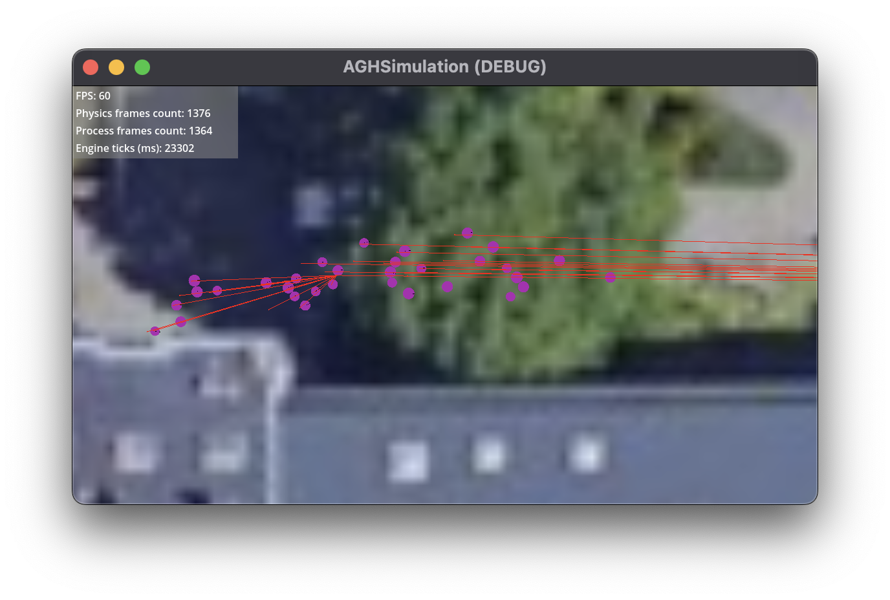
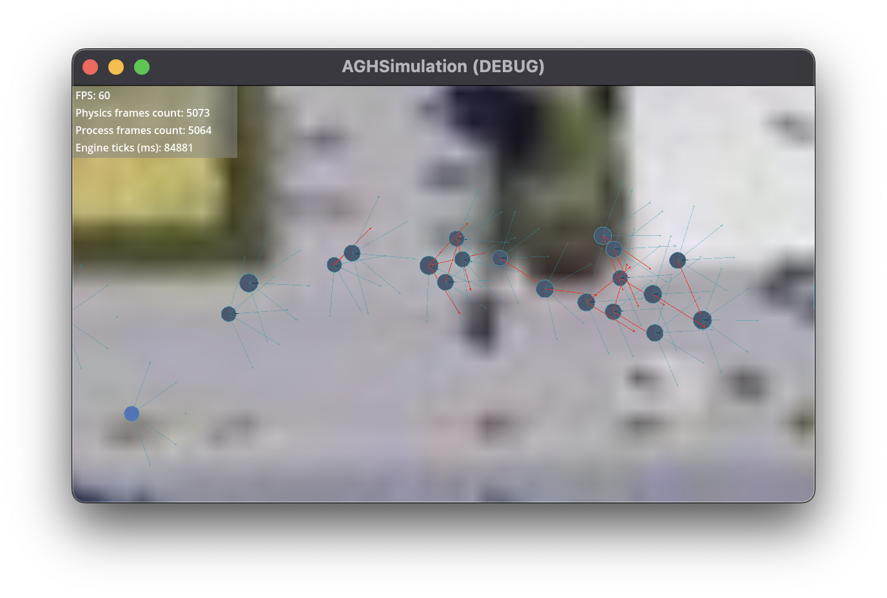

## Framework

In order to enhance the robustness and realism of the simulation, a
sophisticated pathfinding algorithm was employed. This approach represented a
significant enhancement over the previously discussed methodology that relied on
raycasts, shown in [@fig:godot-raycast], thereby enabling more efficient and
optimal crowd movement, particularly in complex scenarios. The integration of
Reciprocal Velocity Avoidance (RVA) played a pivotal role in the implementation
of pathfinding. RVA has been shown to be particularly effective in managing
dynamic obstacles and agent-to-agent avoidance, thus making it an excellent
choice for crowd simulation.

In order to leverage RVA, it is first necessary to model the collision shapes.
These collision shapes act as a baseline for determining agents' movements
within the environment. The collision shapes ensure that each agent has an
awareness of its surroundings, thus allowing for smooth navigation through
obstacles and other agents.

In the initial stage, the pathfinding algorithm is triggered as soon as an agent
is spawned in the simulation. The algorithm calculates a precise path, presented
in [@fig:godot-paths] by dividing the environment into manageable segments. Each
agent is then tasked with navigating to the next designated point along this
path, ensuring steady progress towards its final destination. This stepwise
approach not only simplifies the navigation process but also enhances
performance by breaking down complex paths into smaller, more manageable
segments.

{#fig:godot-paths}

Moreover, the raycast methodology is maintained as an ancillary system to
enhance interactions between agents and to achieve current targets along the
designated path. While pathfinding directs agents along optimal routes, raycasts
augment their capacity to respond to immediate, short-range interactions, such
as avoiding collisions or dynamically adjusting their paths based on proximate
agents. This dual-system approach amalgamates the strengths of long-range
planning with real-time responsiveness.

The entire simulation was developed using Godot 4.3, a game engine that has been
demonstrated to be well-suited for handling the computational and graphical
demands of such projects. Godot provides a native implementation of Reciprocal
Velocity Avoidance, which was adapted and integrated into the system.
Furthermore, custom raycast functionality was implemented in order to align with
the unique requirements of the simulation. These customisations were essential
for achieving the desired level of precision and realism in agent behaviour.

The efficacy and realism of the simulation have been enhanced to a considerable
degree by the integration of RVA for pathfinding and raycasts for local
interactions. This methodology guarantees that agents can navigate complex
environments with ease, whilst maintaining dynamic, responsive interactions with
their surroundings and other agents.

{#fig:godot-raycast}
