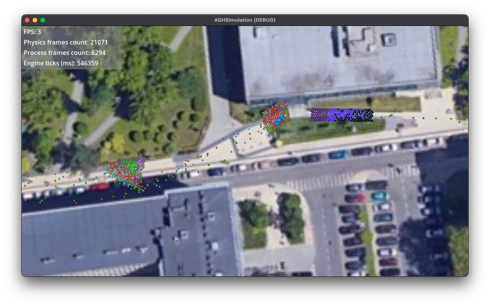
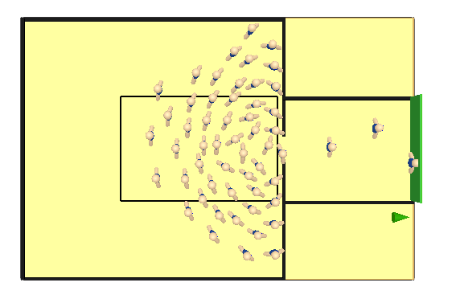
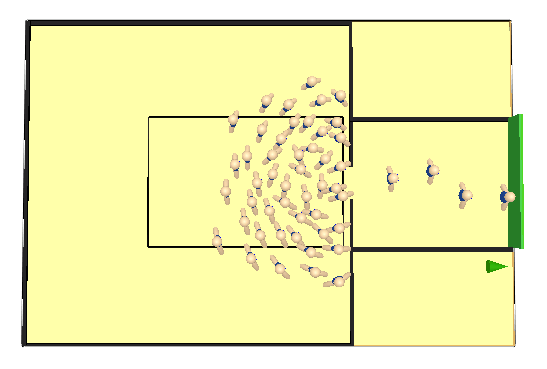
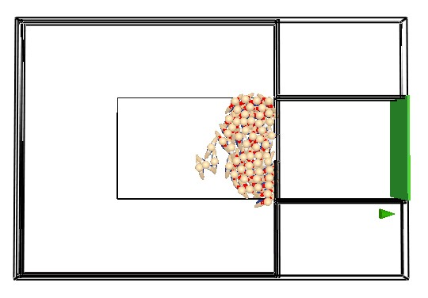

# Results

A series of experiments were conducted with the objective of gathering all
agents in front of the AGH Main Library building. The number of agents in the
group was selected empirically during the course of the work. An excess of
agents resulted in congestion in the bottlenecks, which include the stairs and
the wheelchair ramp, as illustrated in [@fig:godot-stuck].

{#fig:godot-stuck}

When agents are moving freely, the interpersonal distance is sufficiently large
to have no effect on their routing, as illustrated in
[@fig:wang2022simulation-007].However, when the density is higher, as depicted
in [@fig:wang2022simulation-008], the interpersonal distance decreases and the
agents begin to avoid each other. Further reduction in interpersonal distance
results in agents blocking and pushing each other, thereby preventing movement
(see [@fig:wang2022simulation-009]). It is also assumed that agents falling down
and impeding the passageway [@wang2022simulation] are present.

{#fig:wang2022simulation-007 width=33%}
{#fig:wang2022simulation-008 width=33%}
{#fig:wang2022simulation-009 width=33%}

The present study explores the impact of interpersonal distance on bottleneck
movement [@wang2022simulation]

It is also pertinent to mention the scenario in which agents attempt to traverse
a bottleneck in opposite directions, as depicted in
[@fig:farina2017walking-021]. In such circumstances, the agents begin to impede
each other's progress until one of them is impeded by the others. This
phenomenon can occur during entry or exit from a building, as agents endeavour
to navigate through narrow doorways. Although the present simulation does not
include such door-passing, this behaviour has been observed between building C-4
and the AGH Main Library (agents marked in green and pink in
[@fig:godot-groups]).

![Agents attempting to move in opposite directions through a bottleneck of the metro train boarding process [@farina2017walking]](images/farina2017walking-021.png){#fig:farina2017walking-021}
